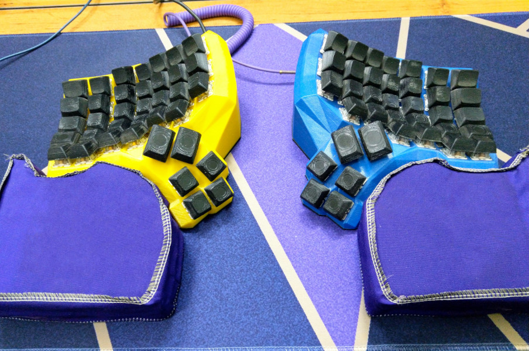

# Hossein Naderi's Dactyl keyboard



## Build

### Print parts
3D print parts from [here](./body)

### Print keycaps (optional)
You can also use any cherry style keycaps. I've configured and printed mine using openscad.
you can create your own custom keycaps from [here](./keycaps)

### Assemble

TBD

## Program

### customize keyboard layout
as you like

### build firmware
there are several ways to build:
- use artifact from ci build (preferred way) [download latest build](https://gitlab.com/hnaderi/my-dactyl/-/jobs/artifacts/main/download?job=build)
- build config online at [qmk online](https://config.qmk.fm) and download hex file.
- run the ci script manually

### uploading firmware
program each side using:
```sh
sudo sleep 5; sudo avrdude -p m32U4 -P /dev/ttyACM0 -c avr109 -U flash:w:handwired_dactyl_manuform_5x7_hnaderi.hex
```
then reset board using reset macro or from pin headers immediately.
